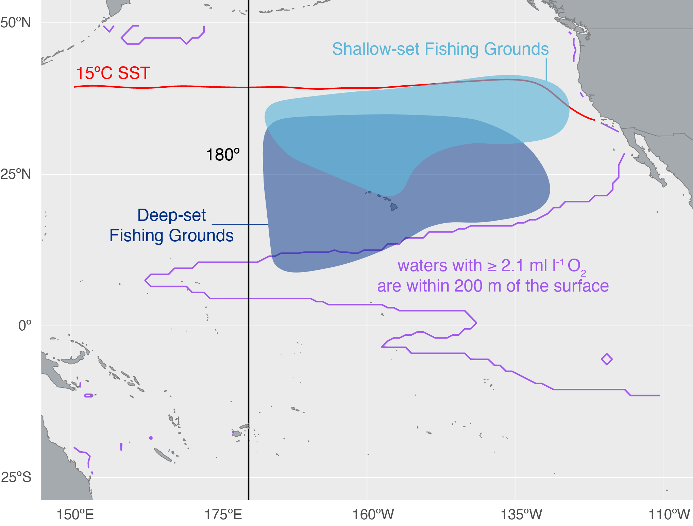

# Fisheries modeled {#sec-AboutFisheries}

This model is built to capture the Hawaiʻi-based longline fishery, which is 
actually two fisheries: a tuna fishery and a swordfish fishery.  The tuna 
fishery targets bigeye tuna (*Thunnus obesus*) and is often referred to as the
"deep-set fishery" because it sets its hooks deeper in the water column 
(100--400 m) to capture bigeye tuna when they're foraging at depth during the
daytime (@Bigelow2006).  As the name suggests, the swordfish fishery targets 
swordfish (*Xiphias gladius*) and is often referred to as the "shallow-set fishery"
because it sets it hooks closer to the surface (upper 100 m) to capture 
swordfish when they're foraging at night (@Bigelow2006).  The deep-set fishery
is by far the larger of the two fisheries by any measure (e.g., vessels, hooks,
catch, revenue).  It operates year-round while the swordfish fishery is seasonal
and concentrates its effort in the winter.  The fisheries also have different
spatial footprints, as seen in @fig-1.  Broadly, the longline fishery fishes in
an area roughly bounded by the dateline, the 15$\degree$C sea surface temperature
isotherm (@WOAtemp), the western edge of the US EEZ off California, and low-oxygen waters
in the eastern tropical Pacific (which we define as waters within 200 m of the
surface having less than 2.1 ml l^-^^1^ O~2~; @WOAoxygen).

{#fig-1
alt="a map of the Pacific Ocean with polygons for fishing area and boundaries described in the text"}

