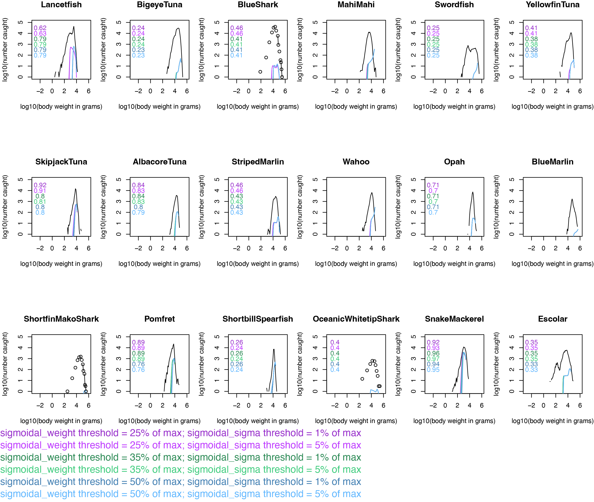
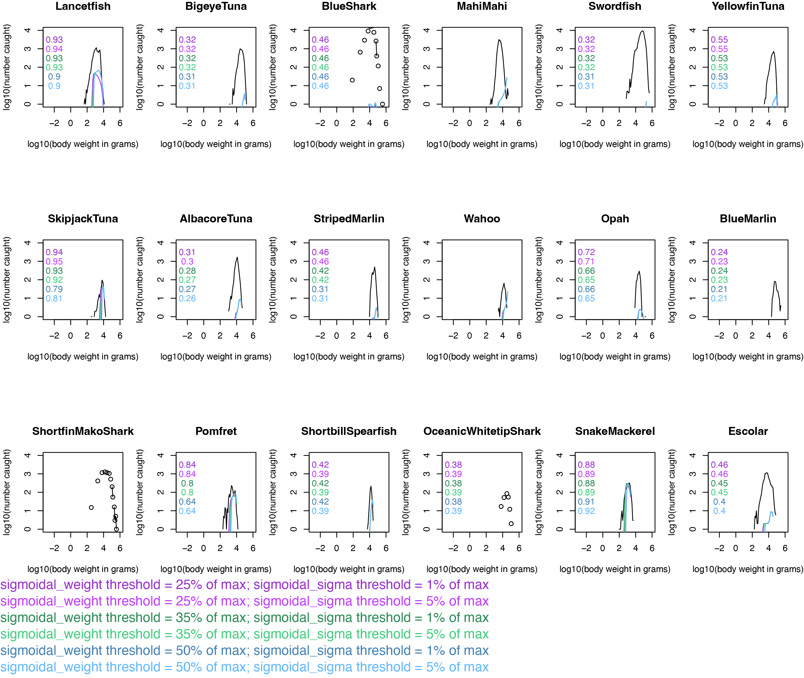

# Calibration/Validation {#sec-CalVal}

The previous sections present the final parameters that we settled on after 
much work and adjusting.  The process by which these came together involved 
quite a bit of iteration, particularly setting the selectivity parameters.  

We have elected to fit our modeled catch-at-size to observed catch-at-size.  This
is the best, most comprehensive information we have about the system we're 
modeling.  While this approach doesn't quite fit the bill for validation, it's
the best we can do with what we have and offers a reasonable calibration 
approach.

Figures @fig-calval-deep and @fig-calval-shal below show a variety of 
selectivity parameter permutations we tested and their resulting significant
(*p* < 0.05) correlation coefficients.  Modeled and observed catch-at-size was
compared and figures were generated with [this code](https://github.com/noaa-pifsc/Pelagic-mizer-model/blob/main/ModelBuild/FisheryData/CatchComparison.Rmd).

In addition to trialing different thresholds for *sigmoidal_weight* and 
*sigmoidal_sigma* we also tested several values for *kappa* which is a 
parameter that informs initial abundances.  In the end, we kept the 
default value (10^11^) because it resulted in catch magnitudes that most 
closely matched observed catch.

We also changed the following default parameters:  

* *w_pp_cutoff*: Because this model is mostly apex predators, we extended the 
maximum size of the background resource to span the full size range of modeled
fish.  This acknowledges that there are a lot of species in this food web that
we're not modeling.  
* *n*: We set this allometric scaling exponent for maximum intake rate to be 3/4.
There are different theories on what value is appropriate and likely no single
answer is correct.  
* *p*: We set this allometric scaling exponent for metabolic rate to be 3/4.
Like the previous parameter, there are different theories on what value is 
appropriate and likely no single answer is correct.

These parameters resulted in a model with:  

* the closest correlations to observed catch-at-size for the greatest number of species,
* total food web biomass size structure that comports with ecological theory in 
that the amount of biomass doesn't vary by size, and
* feeding levels that suggest all sizes have enough food[^1]

[^1]: This implies that our system is not food limited, which is interesting to
think about.  Since our goal was to build a steady state model in which all
modeled species coexist, this assumption seems fitting.  However, you can explore
questions of food limitation with mizer.  See @sec-Possibilities for more on this.

{#fig-calval-deep
alt="line plots and coorelation values showing that, for the deep-set fishery, model fit varies by species and is generally best using the sigmoidal_weight threshold of 25% and the sigmoidal_sigma threshold of 1%"}

{#fig-calval-shal
alt="line plots and coorelation values showing that, for the shallow-set fishery, model fit varies by species and is generally best using the sigmoidal_weight threshold of 25% and the sigmoidal_sigma threshold of 1%"}