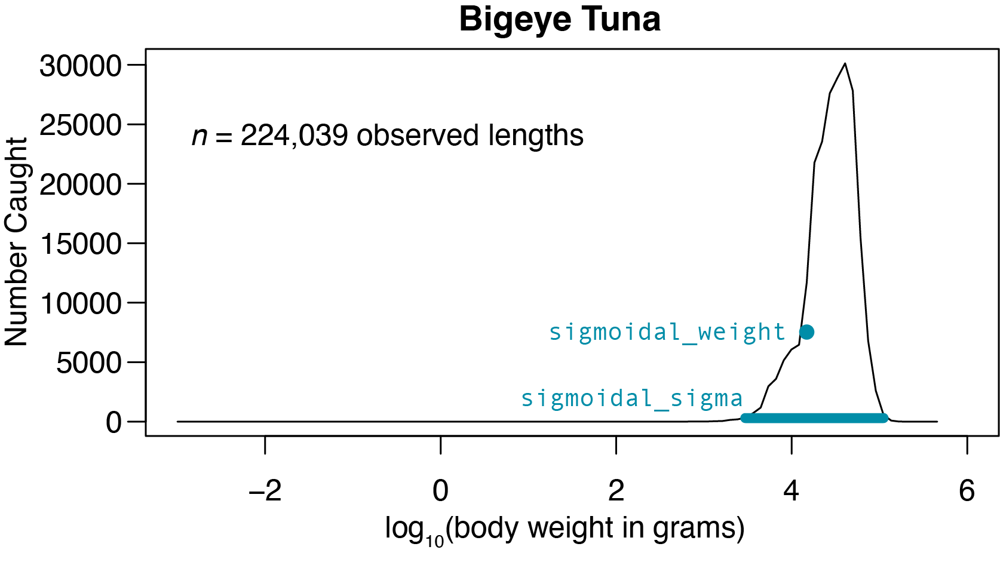

# Fishing parameters {#sec-FishingParams}

In [mizer](https://sizespectrum.org/mizer/) fishing mortality *(F)* is the 
product of selectivity *(S)*, catchability *(Q)*, and effort *(E)*, which operate 
over gears *(g)*, species *(i)*, and size *(w)*:
$$
\begin{align}
F_i = S_{g,i,w} \times Q_{g,i} \times E_g 
\end{align}
$$

Note that in [mizer](https://sizespectrum.org/mizer/) size is body weight in 
grams unless otherwise specified.

We'll start with effort *(E)*, which is specific to gear type.  For this model, the
two gear types are `DeepSet` and `ShallowSet`.  To inform this parameter for 
each gear, we looked at the proportion of total longline effort (hooks set) each
gear type deployed over the period from February 2006 through December 2024,
pooled (see @sec-AboutData):  

* `DeepSet` Effort: 0.985
* `ShallowSet` Effort: 0.015

Catchability *(Q)* is specific to both gear and species.  To approximate this as
best we can, we use the fishing mortality estimates from stock assessments in
place of catchability, applying them equally to both gears.  When multiplied by 
effort *(E)* and summed across gears *(g)*, this results in fishing mortality
*(F)* that's equal to the assessment estimates.  For unassessed species, we
use a default value of *Q* = 0.2.  See @tbl-params and @tbl-refs in @sec-SpeciesParams
for estimates and their sources. 

Selectivity *(S)* was informed by observer data (see @sec-AboutData).  We used
[mizer's](https://sizespectrum.org/mizer/) `sigmoid_weight` selectivity function
and set `sigmoidal_weight` to the smallest size that experiences at least 25%
as much catch (in number of fish caught) at the size that sees the greatest 
catch and `sigmoidal_sigma` as the number of size classes that experience at
least 1% as much catch as the size the sees the greatest catch. An example of 
these values for bigeye tuna are shown in @fig-S below.  When determining
these values, we binned sizes to match those used in our mizer model (see 
@sec-RunningMizer).  You can view our code for identifying these values
[here](https://github.com/noaa-pifsc/Pelagic-mizer-model/blob/main/ModelBuild/FisheryData/CatchSpectra.Rmd).

Fishing-related parameters, or as [mizer](https://sizespectrum.org/mizer/) calls 
them, gear parameters, are summarized in @tbl-gear.  Species-specific fishing 
mortality at size is presented in @fig-F below.

{#fig-S
alt="a line plot showing that bigeye tuna catch peaks at about 30 kg, sigmoidal_weight is roughly 10000 and sigmoidal_sigma spans from roughly 3 to 100 kg"}

```{r}
#| echo: false
#| message: false
#| label: tbl-gear
#| tbl-cap: Gear parameters

# Load the libraries we'll need
library(tidyverse, quietly = TRUE)
library(knitr)
library(here)

# Load the table data
gear_params <- read_csv(here("OverviewContent", "Pelagic_gear_params_25_1.csv"))

# Make the table
kable(gear_params)
```


```{r}
#| echo: false
#| message: false
#| label: fig-F
#| fig-cap: Species-specific catch at size as parameterized in our mizer model
#| fig-alt: line plots showing that catch is greatest for the largest sizes of each species and that these values match assessment estimates

# load package
library(mizer)

# load parameters
pelagic_species_params <- read_csv(here("Pelagic_params.csv"), show_col_types = FALSE)
pelagic_gear_params <- read.csv(here("Pelagic_gear_params_25_1.csv"), row.names = 1)
pelagic_interaction <- read.csv(here("Pelagic_interaction.csv"), row.names = 1)

# tidy up
pelagic_species_params <- pelagic_species_params |>
  mutate(catchability = NULL)

# effort
effort <- c(DeepSet = 0.985, ShallowSet = 0.015)

# new model
pelagic_params <- newMultispeciesParams(species_params = pelagic_species_params,
                                        gear_params = pelagic_gear_params,
                                        interaction = pelagic_interaction,
                                        initial_effort = effort,
                                        n = 0.75, p = 0.75,
                                        w_pp_cutoff = 455400)

# steady
pelagic_steady <- steady(pelagic_params)

# interactive plot
plotlyFMort(pelagic_steady)
```


