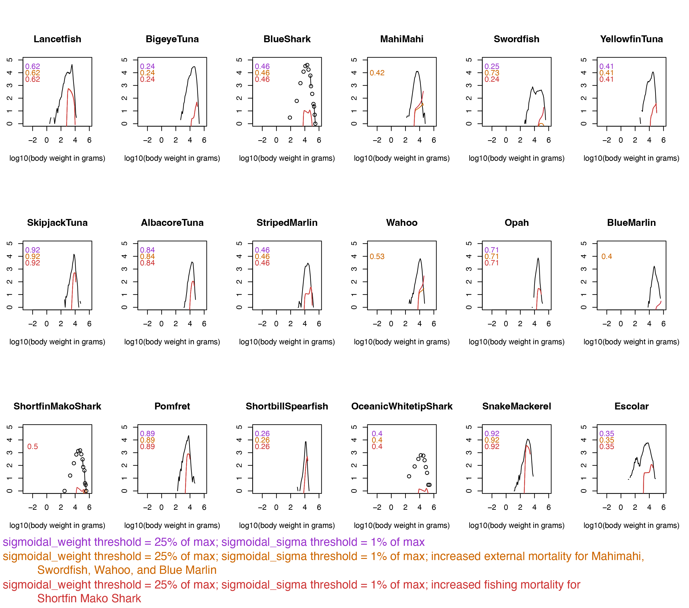
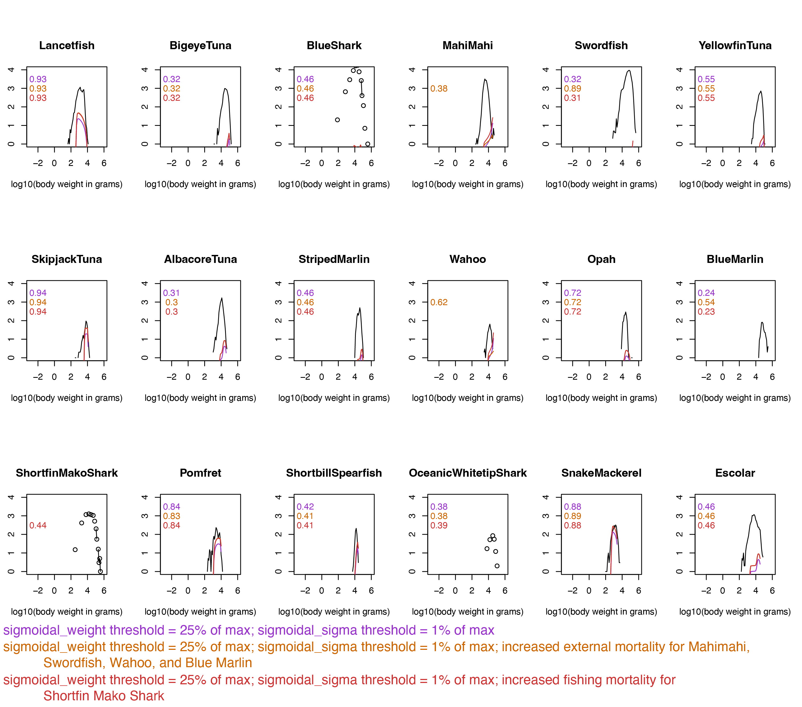

# Fit Improvement Options

The model presented here offers an improvement over @WoodworthJefcoats2019 in 
that it:  

* includes six additional species, 
* models the shallow-set swordfish fishery, and 
* better fits modeled to observed catch-at-size.  

We've taken a consistent approach to parameterizing all modeled species and 
stopped short of taking any species-specific steps to improve the model.  That 
said, there are still ways the model could be improved.  We discuss a few 
options here.  

## Improving modeled spectra

There are four species for which the size spectra fail to decrease at the 
largest body sizes: mahi mahi, wahoo, swordfish, and blue marlin.  You can see
this in @fig-spectra below.  It may help to zoom in and reposition the figure.

```{r}
#| echo: false
#| message: false
#| label: fig-spectra
#| fig-cap: Steady state biomass spectra
#| fig-alt: Biomass spectra that behave as expected except for the four species discussed

library(mizer) 
library(here)
library(tidyverse)

pelagic_species_params <- read_csv(here("Pelagic_params.csv"), show_col_types = FALSE)
pelagic_gear_params <- read.csv(here("Pelagic_gear_params_25_1.csv"), row.names = 1)
pelagic_interaction <- read.csv(here("Pelagic_interaction.csv"), row.names = 1)

pelagic_species_params <- pelagic_species_params |>
  mutate(catchability = NULL)

effort <- c(DeepSet = 0.985, ShallowSet = 0.015)

pelagic_params <- newMultispeciesParams(species_params = pelagic_species_params,
                                        gear_params = pelagic_gear_params,
                                        interaction = pelagic_interaction,
                                        initial_effort = effort,
                                        n = 0.75, p = 0.75,
                                        w_pp_cutoff = 455400)

pelagic_steady <- steady(pelagic_params)

plotlySpectra(pelagic_steady, power = 2, total = TRUE)
```

The likeliest reason for this behavior is that these species don't experience
enough predation mortality.  These four species have the smallest total 
interaction with other species (@tbl-inter) by virtue of their depth 
range parameters (@tbl-params).  One way to address this would be to 
increase external mortality for these four species.  In mizer, external 
mortality covers all sources of mortality that aren't explicitly modeled: 
predation by species that aren't included (e.g., cetaceans), capture by 
fisheries that aren't included, disease, environmental stress, etc.

In mizer, the [default approach](https://sizespectrum.org/mizer/reference/newMultispeciesParams.html#setting-external-mortality-rate) 
to calculating species-specific external mortality, $\mu$, is effectively:
$$
\begin{align}
\mu = 0.6 w_{max}^{-0.25}
\end{align}
$$
Below is one approach to using external mortality to capture unmodeled 
predation on mahi mahi, wahoo, swordfish, and blue marlin.

```{r, eval = FALSE}
# Initial matrix: 0 for all sizes of all species
ext_mort <- matrix(0, nrow = length(sp), ncol = length(w),
                   dimnames = list("species" = c(sp), 
                                   "w" = c(w)))

# First, fill with default values
for (s in seq(1, length(sp), 1)) {
  ext_mort[s,] <- 0.6 * w_max[s]^-0.25
}

# Identify the rows for our species
idx <- which(sp == "MahiMahi" | 
             sp == "Swordfish" |
             sp == "Wahoo" | 
             sp == "BlueMarlin")

# Loop through them and set external mortality an order of magnitude higher
# for our species
for (r in idx) {
  ext_mort[r,] <- 10 * (0.6 * w_max[r]^-0.25)
}

# Turn it into a data frame
ext_mort <- as.data.frame(ext_mort)

# Save things
write.csv(ext_mort, here("Pelagic_external_mortality_10x.csv"), row.names = TRUE, col.names = TRUE)
```

When you run mizer (see @sec-RunningMizer), you'd then load the external 
mortality in the same way other parameters are loaded:  
```{r, eval = FALSE}
# Load (along with other parameters)
pelagic_external_mortality <- as.matrix(read.csv(here("Pelagic_external_mortality_10x.csv"), row.names = 1))
```

And attach the external mortality after creating a `newMultispeciesParams()`
object called `pelagic_params` (again, see @sec-RunningMizer):
```{r, eval = FALSE}
pelagic_params <- setExtMort(pelagic_params,
                             ext_mort = pelagic_external_mortality)
```

We found that this approach improved the fit for four species in question 
(@fig-improve-deep and @fig-improve-shallow).  However, we haven't included 
this in the workflow outlined because the approach is subjective (level of 
increased mortality) and species-specific and therefore might not be appropriate 
for all applications. 

## Improving catch-at-size

As we can see in @fig-improve-deep and @fig-improve-shallow, improving the 
behavior of the spectra for the four species with poor ones improved their 
correlation with observed catch-at-size.  Another way to achieve this, and to 
improve the fits for some other species (e.g., shortfin mako sharks) would be to 
increase the level of fishing mortality they experience.

In the examples shown here, we changed the catchability value (and thus *F*) 
for shortfin mako shark from 0.018 to 0.2.  This improved the correlation 
coefficients for both the deep-set and shallow-set catch-at-size such that were
significant (*p* < 0.05) and greater than that of several other species.
Similar results were obtained for other species when we experimented with 
increasing fishing mortality systematically for all species.  Something to 
think about when considering @sec-Possibilities.

{#fig-improve-deep alt="line plots and coorelation values showing that, for the deep-set fishery, model fit improves for some species when external or fishing mortality are increased"} 

{#fig-improve-shallow alt="line plots and coorelation values showing that, for the shallow-set fishery, model fit improves for some species when external or fishing mortality are increased"}

## Improving life history parameters

Because mizer is a size structured model, the parameters for weight-at-maturity,
*w_mat*, and maximum weight, *w_max*, are particularly important.  These values 
are used to inform processes such as reproduction and natural 
mortality.  Confirming that there aren't better estimates available, and 
updating the parameters as new science comes to light, would likely improve the 
model.  

## Improving predation

The species in this model are nearly all apex predators.  The limited diet 
studies available suggest that they primarily eat species other than each other. 
For this reason, we extend the background resource for the full size range of 
fish modeled.  As a result, most of the predation is of the background resource.
While this is probably realisitic, it does mean that there's very little in the
model in the way of predator-prey interactions.  Changing one species has 
little effect on other species. This could be changed by rethinking how
predation is modeled. For example, the maximum size of the background resource
could be reduced, mid-trophic level species could be added to the model, or
the interaction matrix could be approached differently.  

## Improving fishing mortality

We use fishing mortality estimates from stock assessments where possible.  But
the footprints of these assessments extend beyond the footprints of the 
fisheries we represent in the model.  We base our approach on both the minimal
international effort where the Hawaiʻi-based fleets operate and on the 
likelihood that the footprint modeled is large enough to be representative of
the full assessment areas.  That said, there's room for improvement in how
international fisheries in particular are accounted for.  Here, we discuss two
possible approaches.

It would be straightforward to add additional international deep-set and
shallow-set longline fleets parameterized identically to the existing domestic
fleets.  The balance of effort across the fleets could likely be gathered from
publicly accessible international fisheries data.  Validating the modeled 
catch would be challenging, though, given the confidential nature of the 
needed international data. 

Our model also omits explicit representation of Pacific purse seine 
fleets.  These fleets contribute to the mortality of small, young individuals of 
the species in our model.  It's possible that capturing this size-specific 
mortality on immature individuals would improve their model fit.

## Which approach to take?

Whether and how you improve the model depends on your application.  In general,
it seems prudent to go with the approach that requires the least amount of 
subjective adjustment yet still results in a model that's equal to your 
questions.