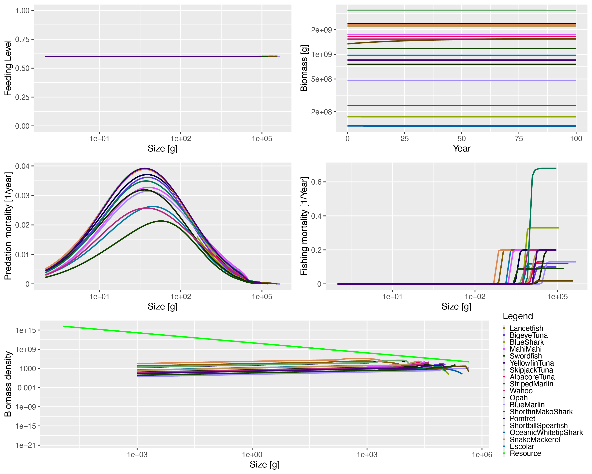

# Running mizer {#sec-RunningMizer}

This section walks you through running [mizer](https://sizespectrum.org/mizer/)
using the parameters [provided](https://github.com/noaa-pifsc/Pelagic-mizer-model) 
for Hawaiʻi-based longline fisheries.  We note that when building the model as
described in the previous sections it was necessary to run the model throughout
the build process to identify challenges and access parameters.  For example, 
when binning observed catch-at-size (see @sec-FishingParams), we had to run 
[mizer](https://sizespectrum.org/mizer/) in order to extract the size bins.  All 
this is to say, while we present things here as a straightforward unidirectional 
workflow, know that building and working with your own model will be interative.

[Mizer](https://sizespectrum.org/mizer/) runs in [R](https://www.r-project.org/).
We recommend using [RStudio](https://posit.co/products/open-source/rstudio) or
a similar platform, simply for ease of use.

If you haven't already, install [mizer](https://sizespectrum.org/mizer/):
```{r, eval = FALSE}
install.packages("mizer")
```

Load the package into your R session:
```{r}
library(mizer) 
```

There are two other packages that we use in our workflow: [tidyverse](https://tidyverse.org/)
and [here](https://here.r-lib.org/).  They aid interacting with data and 
file path management, respectively.  Install them if needed:
```{r, eval = FALSE}
install.packages("tidyverse")
install.packages("here") 
```

Load them:
```{r, message = FALSE}
library(tidyverse, quietly = TRUE) 
library(here) 
```

Next up, you'll need to load the parameter files and interaction matrix.  The
code here assumes that you've set up an R project that matches the structure of
our [repository](https://github.com/noaa-pifsc/Pelagic-mizer-model).  If you 
set things up differently, you'll need to adjust the file paths accordingly. 
```{r}
pelagic_species_params <- read_csv(here("Pelagic_params.csv"), show_col_types = FALSE)
pelagic_gear_params <- read.csv(here("Pelagic_gear_params_25_1.csv"), row.names = 1)
pelagic_interaction <- read.csv(here("Pelagic_interaction.csv"), row.names = 1)
```

We added `catchability` to the species parameters because it made it easier to 
track the references we used.  It also allowed us to easily <add> them to the 
gear parameters. We're going to remove that column now, just to avoid any 
possible confusion down the line.
```{r}
pelagic_species_params <- pelagic_species_params |>
  mutate(catchability = NULL)
```

We also need to define fishing effort *(E)* (see @sec-FishingParams):
```{r}
effort <- c(DeepSet = 0.985, ShallowSet = 0.015)
```

Now, we're ready to set up the model for use.  Exciting!  We're going to create 
a multi-species model with our parameters, plus some adjustments discussed in 
@sec-CalVal:
```{r}
pelagic_params <- newMultispeciesParams(species_params = pelagic_species_params,
                                        gear_params = pelagic_gear_params,
                                        interaction = pelagic_interaction,
                                        initial_effort = effort,
                                        n = 0.75, p = 0.75,
                                        w_pp_cutoff = 455400)
```

Notice that we received a message about some assumptions the model made based on
the information we did and didn't give it.  This step created a full set of 
parameters that [mizer](https://sizespectrum.org/mizer/)
will use to run simulations.  To look at the species parameters, for example:
```{r, eval = FALSE}
pelagic_params@species_params
```

You can use similar syntax to take a look at the other parameters.  

The next step is to run the model to a steady state:
```{r}
pelagic_steady <- steady(pelagic_params)
```

The default time allowed for this is 100 years, but you can extend that if 
if needed: `steady(pelagic_params, t_max = 500)` would allow 500 years.  Note 
that while we were building our model early iterations of this step resulted in
various warnings that led us to reexamine parameters.  For example, larger 
values of `kappa` led to warnings about unrealistic values for `erepro`.  We
recommend turning to [mizer's](https://sizespectrum.org/mizer/) extensive
documentation if you're encountering errors while building your own model.  If
you encounter errors using the parameters we provided, please 
[open an issue](https://github.com/noaa-pifsc/Pelagic-mizer-model/issues) to let
us know.

At this point, you can take a look at the size spectra of your steady-state 
model: 
```{r}
plotlySpectra(pelagic_steady, power = 2, total = TRUE)
```

A full list of plotting options is available in the mizer 
[documentation](https://sizespectrum.org/mizer/reference/index.html#plotting-results).

Note that when running to a stead state, [mizer](https://sizespectrum.org/mizer/)
recalculates some parameters.  To see what parameters are being used you can 
take a similar approach to that used above.  For example:
```{r, eval = FALSE}
pelagic_steady@species_params
```

You're now ready to run a simulation.  The details of your simulation are
entirely up to you and your collaborators (we offer some ideas in @sec-Possibilities).
Here, we'll do a simple 100-year run where nothing changes.  It's not terribly
exciting (or it shouldn't be), but it does show you how to get started.  Note
that we're running this simulation at a monthly time step (`dt = 1/12`).  A 
temporal discretization of similar magnitude is recommended if you forego the
default value of 0.1.
```{r}
pelagic_sim <- project(pelagic_steady, effort = effort, t_max = 100, dt = 1/12)
```

Here's how to generate a simple summary view of your simulation.  See the 
mizer [documentation](https://sizespectrum.org/mizer/reference/index.html#plotting-results)
for a full list of what you can view. 
```{r, eval = FALSE}
plot(pelagic_sim)
```


